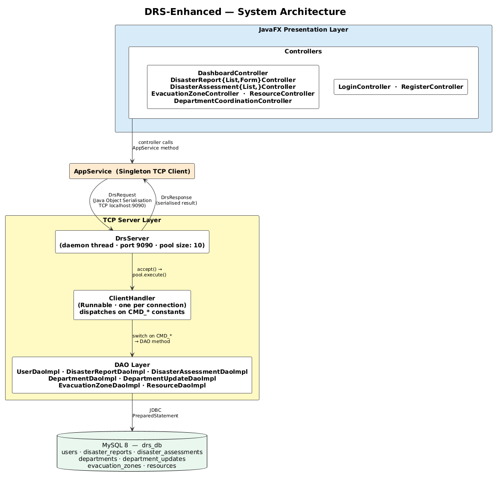
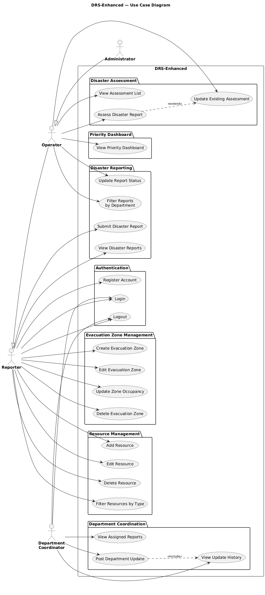
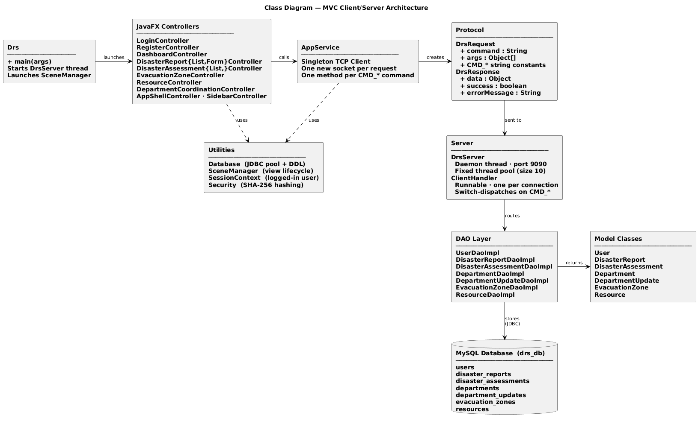
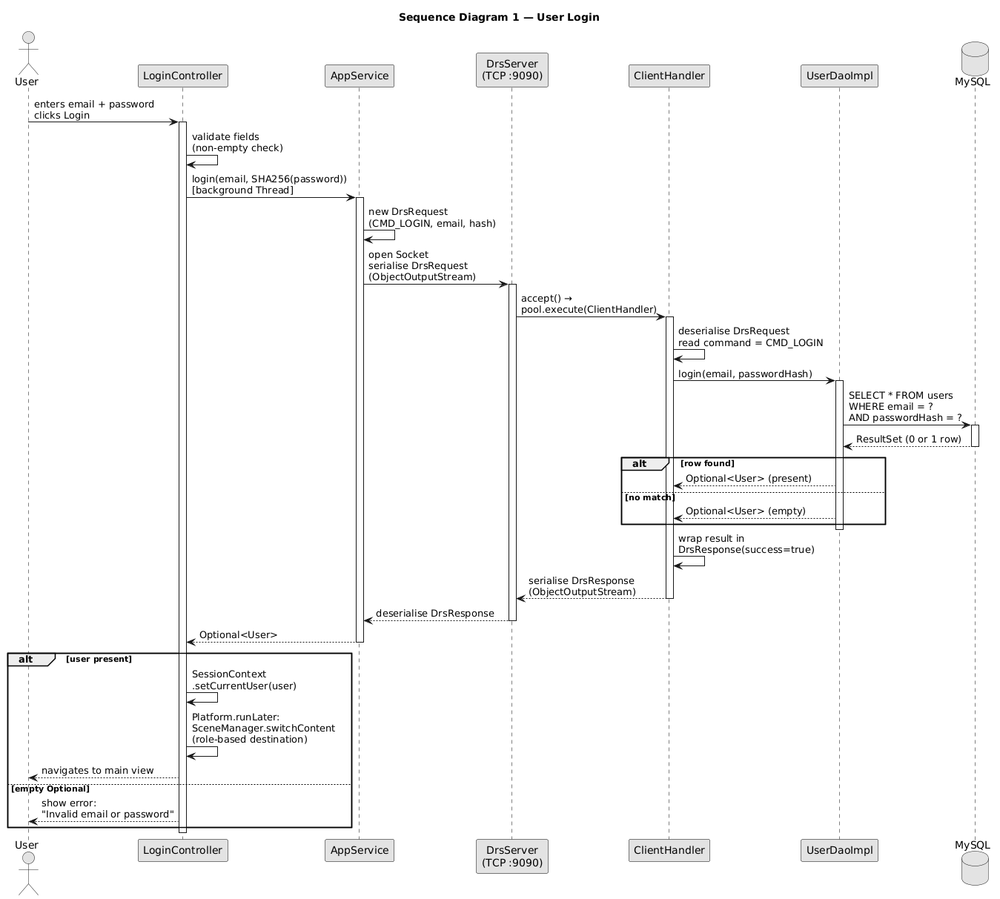
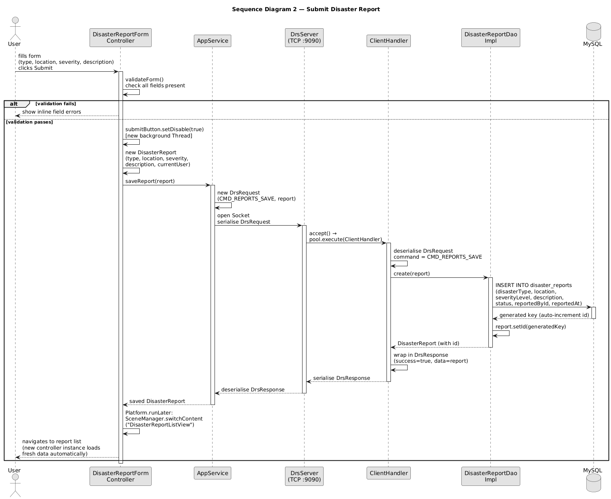
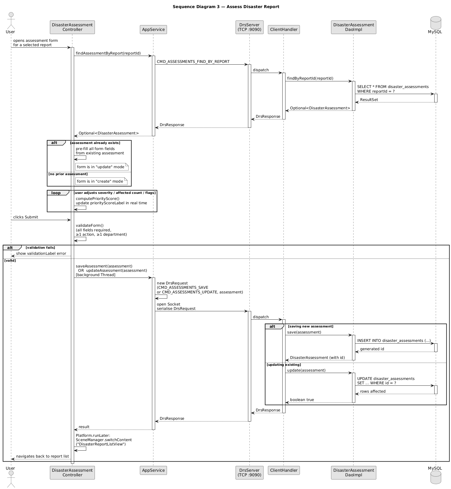
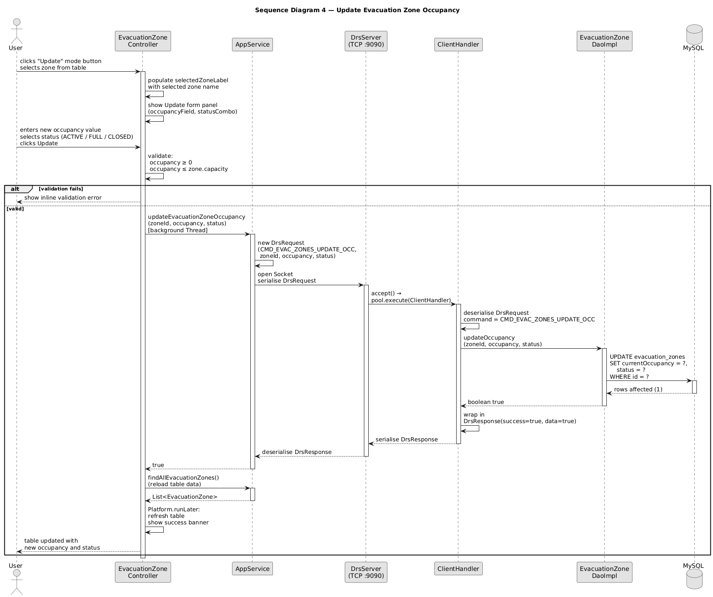
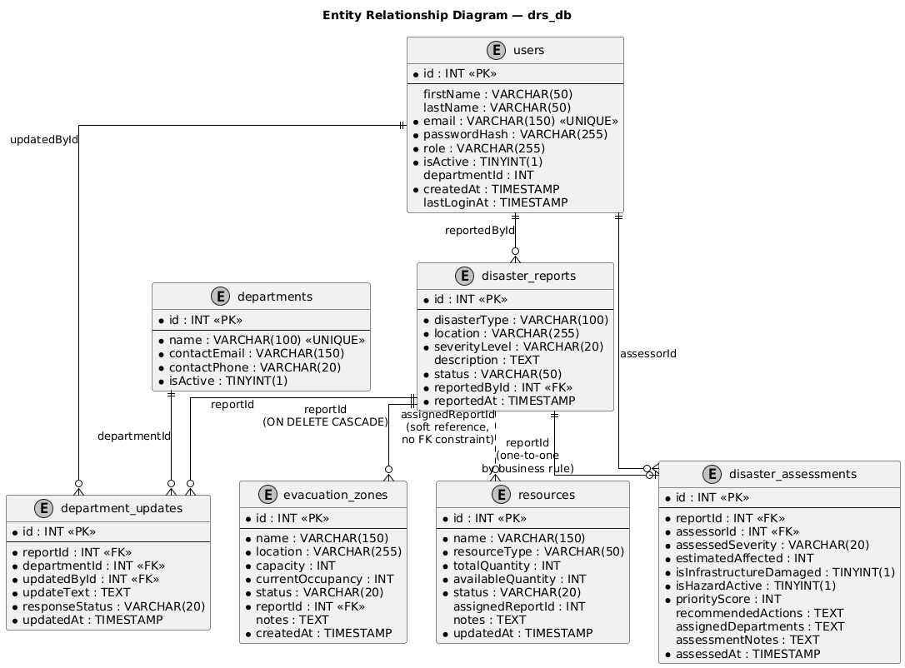

# COIT20258 Software Engineering — Assignment 3
# Group Report: Disaster Response System Enhanced (DRS-Enhanced)

---

## Cover Page

| Field | Details |
|---|---|
| **Course** | COIT20258 Software Engineering |
| **Assignment** | Assignment 3 — Three-Tier Distributed Application |
| **Project Title** | Disaster Response System Enhanced (DRS-Enhanced) |
| **Team Members** | [Member 1 Name — Student ID] |
| | [Member 2 Name — Student ID] |
| | [Member 3 Name — Student ID] |
| | [Member 4 Name — Student ID] |
| **Team Leader** | [Team Leader Name] |
| **GitHub Repository** | [TODO: Insert GitHub URL] |
| **Submission Date** | 12 June 2026 |

---

## Table of Contents

1. Introduction
2. Requirement Specification
   - 2.1 Functional Requirements
   - 2.2 Non-Functional Requirements
   - 2.3 System Requirements
   - 2.4 User Requirements
   - 2.5 Two Additional Features
3. Design Specification
   - 3.1 System Architecture
   - 3.2 Use Case Diagram
   - 3.3 Class Diagram
   - 3.4 Sequence Diagrams
   - 3.5 Entity Relationship Diagram (ERD)
4. Test Plan
5. Evidence of Testing
6. GitHub Repository and Development Process
7. Database Script

---

## 1. Introduction

The Disaster Response System Enhanced (DRS-Enhanced) is a three-tier distributed desktop application developed to support emergency coordination efforts in the aftermath of natural and man-made disasters. The system enables emergency staff to report disasters, assess their severity, manage evacuation zones, track physical resources, and coordinate responses across multiple departments — all from a single, unified interface.

This project builds upon the foundational DRS-Initial system by introducing two additional domain-specific features: Evacuation Zone Management and Resource Management. These additions significantly extend the operational capability of the platform, enabling responders to track shelter capacity and manage deployed assets in real time.

The application is implemented in Java 21 using the JavaFX framework for the graphical user interface and a MySQL 8 database for persistent storage. Communication between the client-side GUI and the database is mediated by an embedded multi-threaded TCP server running within the same JVM process, which handles concurrent client requests using a fixed thread pool. The overall design follows the Model-View-Controller (MVC) architectural pattern, ensuring a clear separation of concerns across all layers of the system.

---

## 2. Requirement Specification

### 2.1 Functional Requirements

The following functional requirements define the core behaviours the system must support.

**FR-01: User Registration**
The system shall allow new users to create an account by providing their first name, last name, email address, password, and role. Each email address must be unique within the system. Passwords are stored as SHA-256 hash values to ensure they are never held in plain text. Department Coordinators must additionally select the department they represent during registration.

**FR-02: User Authentication**
The system shall authenticate users by verifying their email and password against the stored credentials. Upon successful login, the user's session is maintained in memory for the duration of the application session via a `SessionContext` singleton. Role-based redirection is applied immediately after login: users with the DEPARTMENT role are directed to the Department Coordination view, while all other roles are directed to the Disaster Report list.

**FR-03: Disaster Reporting**
Authorised users shall be able to submit new disaster reports by specifying the disaster type (Hurricane, Fire, Earthquake, Flood, Tornado, Tsunami, Landslide, or Other), the affected location, an initial severity level (CRITICAL, HIGH, MEDIUM, or LOW), and a descriptive summary of the event. All reports are automatically timestamped upon creation. Operators and Administrators may subsequently update a report's status through a lifecycle of REPORTED → UNDER\_ASSESSMENT → RESPONDING → RESOLVED.

**FR-04: Disaster Assessment**
Authorised users shall be able to conduct a formal assessment of any reported disaster. An assessment captures the assessed severity, the estimated number of people affected, whether infrastructure has been damaged, and whether an active hazard is present. The system shall automatically compute a priority score based on these inputs using the formula described in Section 2.5. One or more recommended response actions and responsible departments shall be assigned as part of the assessment. A report may be re-assessed at any time, with the existing assessment being updated rather than duplicated.

**FR-05: Priority Dashboard**
The system shall present a real-time dashboard displaying aggregate statistics for all disaster reports, including total reports, the number classified as CRITICAL severity, the number classified as HIGH severity, and the number resolved. A priority table beneath the statistics shall list all assessed disasters ranked in descending order by priority score, providing operators with an immediate overview of the most urgent incidents.

**FR-06: Department Coordination**
The system shall allow Department Coordinators to view the disaster reports assigned to their department and to post status updates against those reports. Each update records a response status (RESPONDING, COMPLETED, or NEEDS\_SUPPORT) alongside a free-text description of the action taken. An update history table on the same screen displays all updates chronologically, showing the department, the person who posted the update, and the timestamp.

**FR-07: Evacuation Zone Management** *(Additional Feature 1)*
The system shall allow authorised users to create, edit, and delete evacuation zones. Each zone is associated with a specific disaster report and records its name, physical location, maximum capacity, current occupancy, and operational status (ACTIVE, FULL, or CLOSED). Users may update the occupancy and status of a zone independently of its other details, supporting rapid updates in a dynamic field environment.

**FR-08: Resource Management** *(Additional Feature 2)*
The system shall allow authorised users to create, edit, and delete resource records covering five categories: Vehicles, Equipment, Personnel, Medical supplies, and general Supplies. Each resource tracks its total quantity, currently available quantity, operational status (AVAILABLE, DEPLOYED, or MAINTENANCE), and, optionally, the disaster report to which it is currently assigned. Resources may be filtered by type for rapid situational awareness.

---

### 2.2 Non-Functional Requirements

**NFR-01: Security**
All passwords shall be stored using the SHA-256 cryptographic hash function, ensuring that plaintext credentials are never persisted to the database. Access to system features shall be governed by the user's assigned role, preventing unauthorised actions. All entities carry server-side timestamps using MySQL's `DEFAULT CURRENT_TIMESTAMP` clause, supporting non-repudiation of data entry.

**NFR-02: Performance**
All database-bound operations shall be executed on a background thread using Java's `Thread` API, leaving the JavaFX Application Thread free to remain responsive. No user-facing operation should cause the graphical interface to become unresponsive or frozen while waiting for a network or database response.

**NFR-03: Reliability and Concurrency**
The embedded TCP server shall support up to ten concurrent client connections simultaneously through a fixed thread pool. Each connection is handled independently by a dedicated `ClientHandler` thread, ensuring that requests from multiple users do not interfere with one another.

**NFR-04: Usability**
The GUI shall provide inline validation feedback on all input forms, surfacing field-level errors adjacent to the offending field rather than relying solely on a global message. All dropdown selectors shall be pre-populated with valid options, minimising the likelihood of invalid data entry.

**NFR-05: Maintainability**
The system shall follow the MVC design pattern, with a strict separation between model classes, FXML-based view definitions, and controller classes. Database access shall be encapsulated within a dedicated DAO layer, where each entity has an interface and a corresponding implementation class, allowing the data-access strategy to be changed without modifying controller logic.

**NFR-06: Portability**
The application shall run on any platform supporting Java 21 and MySQL 8 without modification. All configuration — including database host, port, name, username, and password — shall be externalised to a `.env` file, removing the need to recompile the application when the database environment changes.

---

### 2.3 System Requirements

**Minimum Technical Requirements**

| Component | Requirement |
|---|---|
| Java Development Kit | JDK 17 or above (JDK 21 recommended) |
| JavaFX Runtime | JavaFX 21 |
| Build Tool | Apache Maven 3.8 or above |
| Database | MySQL 8.x |
| MySQL Connector/J | Version 8.3.0 |
| Operating System | Windows 10/11, macOS 12+, or Ubuntu 20.04+ |
| Memory | Minimum 512 MB RAM available to the JVM |
| Network | Localhost TCP access on port 9090 |

The database schema is generated programmatically at application startup via `Database.boot()`, which issues `CREATE TABLE IF NOT EXISTS` statements for all seven tables. This eliminates the need to run a separate DDL script before launching the application for the first time. Additionally, schema migrations — such as adding new columns to existing tables — are handled through guarded `ALTER TABLE` statements that silently ignore the duplicate-column error (MySQL error code 1060), ensuring backward compatibility with existing databases.

---

### 2.4 User Requirements

The system accommodates four distinct user roles, each with a specific set of access rights and responsibilities.

**REPORTER**
A Reporter is a field operative who submits disaster reports as incidents are observed. Reporters can create new reports, view the list of all submitted reports, and manage evacuation zones and resources. They cannot access assessment tools, the priority dashboard, or the department coordination module.

[TODO: Insert screenshot of Reporter view after login — showing report list and available nav buttons]

**OPERATOR**
An Operator is a trained emergency management professional responsible for assessing reports and coordinating responses. Operators have full access to the report list, the assessment module, the priority dashboard, evacuation zones, and resources. They do not have access to the department coordination view.

[TODO: Insert screenshot of Operator view — showing full sidebar navigation with Dashboard, Reports, Assessments, Evacuation, Resources]

**DEPARTMENT COORDINATOR**
A Department Coordinator represents a single external organisation (such as Fire & Rescue or Medical Services). Upon login, they are directed exclusively to the Department Coordination view, where they can view the disaster reports assigned to their department and post response updates. They cannot access any other module.

[TODO: Insert screenshot of Department Coordinator view — showing the coordination screen with only DeptCoordination nav button visible]

**ADMIN**
An Administrator has unrestricted access to all modules across the system, including all features available to Operators. The Admin role is intended for system managers who require a comprehensive view of all operational data.

[TODO: Insert screenshot of Admin view — showing full navigation sidebar]

---

### 2.5 Two Additional Features

#### Feature 1: Evacuation Zone Management

Evacuation Zone Management addresses a critical operational need in disaster response: tracking where displaced civilians are being sheltered and whether those shelters have reached capacity. This feature was not present in DRS-Initial and represents a significant enhancement to the system's field-level utility.

Users with appropriate access can create new evacuation zones linked directly to a specific disaster report, thereby providing contextual association between a shelter and the incident that necessitated it. Each zone records its name, physical address, total capacity, and current occupancy. Three operational statuses — ACTIVE, FULL, and CLOSED — allow coordinators to direct incoming evacuees to appropriate locations without needing to check occupancy figures manually.

The feature supports three distinct operations within a single view: creating a new zone, editing an existing zone's details (name, location, capacity, linked report, and notes), and performing a quick occupancy update (adjusting the current headcount and status). This separation was deliberately designed to support the fast-moving nature of field operations, where occupancy figures change frequently but the zone's core details remain stable. Zones may also be deleted when they are no longer active, with a confirmation dialogue to prevent accidental removal.

[TODO: Insert screenshot of Evacuation Zone view — showing the table and the Create/Edit/Update mode buttons]

#### Feature 2: Resource Management

Resource Management provides a centralised inventory for the physical assets deployed during a disaster response operation. Prior to the introduction of this feature, there was no mechanism within the system to track whether vehicles, personnel, or medical supplies had been dispatched and to which incident they had been assigned.

The feature supports five resource categories — VEHICLE, EQUIPMENT, PERSONNEL, MEDICAL, and SUPPLIES — and three operational statuses: AVAILABLE, DEPLOYED, and MAINTENANCE. Users can create new resources, edit existing records, filter the resource table by category, and delete obsolete entries. Optionally, a resource may be linked to an active disaster report, enabling commanders to quickly identify which assets are already committed to which incident.

The available quantity field is validated to ensure it never exceeds the total quantity, preventing logically inconsistent records (for example, listing more available units than exist in total). The `updatedAt` timestamp is managed automatically by MySQL's `ON UPDATE CURRENT_TIMESTAMP` clause, providing an accurate audit trail of when each resource record was last modified.

[TODO: Insert screenshot of Resource view — showing table with type filter and Create/Edit form]

---

## 3. Design Specification

### 3.1 System Architecture

DRS-Enhanced is a three-tier application in which all three tiers execute within a single JVM process. This design choice simplifies deployment — the application requires no separately hosted server process — while still satisfying the architectural requirements of a three-tier system.

**Tier 1 — Presentation Layer (JavaFX Client)**
The presentation layer is built using JavaFX 21 with FXML-defined views. Each screen corresponds to a dedicated FXML file and an associated Java controller class. Navigation between views is managed by the `SceneManager` utility, which loads view files dynamically using `FXMLLoader` each time a navigation event is triggered, ensuring that every controller instance is fresh and that data displayed is always current. The `AppShellController` acts as a container for the main application window, housing a `SidebarController` for navigation and a `StackPane` content area into which individual views are injected.

**Tier 2 — Business Logic / Server Layer (TCP Server)**
The middle tier is an embedded TCP server (`DrsServer`) that runs on a daemon thread bound to `localhost:9090`. Upon receiving a connection, the server assigns it to a `ClientHandler` from a fixed thread pool of ten workers. The `ClientHandler` deserialises an incoming `DrsRequest` object — which carries a command string and a variable-length argument array — dispatches the command to the appropriate DAO method, and serialises a `DrsResponse` object back to the client. The client side of this layer is the `AppService` singleton, which opens a new socket connection for each request, sends the serialised `DrsRequest`, and blocks until the `DrsResponse` is returned.

All inter-process communication uses Java's built-in object serialisation (`ObjectInputStream` / `ObjectOutputStream`). All model classes implement `java.io.Serializable` to support this transport mechanism.

**Tier 3 — Data Layer (MySQL via JDBC)**
The data layer consists of seven DAO interface/implementation pairs (one per domain entity) and a `Database` utility class. DAOs obtain a JDBC connection from `Database.getConnection()` on each call and execute parameterised SQL statements using `PreparedStatement` to prevent SQL injection. The database schema is auto-generated on first launch, with seeded reference data (departments and sample records) inserted using `INSERT IGNORE` to ensure idempotent initialisation.

**Architecture Diagram**



**Request Lifecycle**

1. A controller method calls `AppService.someMethod()`.
2. `AppService` opens a new TCP socket to `localhost:9090`, serialises a `DrsRequest` object carrying a `CMD_*` command string and any required arguments, and blocks awaiting a response.
3. `DrsServer` accepts the connection and assigns a `ClientHandler` thread from the pool.
4. `ClientHandler` deserialises the `DrsRequest` and dispatches it via a `switch` statement to the corresponding DAO method.
5. The DAO executes a parameterised SQL statement against MySQL via JDBC and wraps the result in a `DrsResponse`.
6. `ClientHandler` serialises the `DrsResponse` and closes the connection.
7. `AppService` deserialises the response, checks the success flag, and returns the typed data to the controller (or throws a `RuntimeException` if the server reported an error).
8. The controller updates the JavaFX UI on the Application Thread via `Platform.runLater()`.

---

### 3.2 Use Case Diagram



The diagram models four actors. `Operator` is a specialisation of `Reporter` (inheriting all Reporter use cases), and `Administrator` is a further specialisation of `Operator`, granting full system access. `Department Coordinator` is a standalone actor with access restricted exclusively to the Department Coordination module.

Two inter-use-case relationships are shown: *Assess Disaster Report* `<<extend>>`s *Update Existing Assessment*, capturing the fact that re-assessing an already-assessed report is an optional extension of the base assessment flow; and *Post Department Update* `<<include>>`s *View Update History*, since the coordination screen always loads the update history alongside the submission form.

---

### 3.3 Class Diagram



The diagram presents the system's MVC client/server architecture as grouped component boxes, reflecting the logical layer each class belongs to rather than individual class-level detail. The flow reads left to right: `Drs` bootstraps the application, the JavaFX controllers delegate all data operations to `AppService`, which communicates with the TCP server by serialising `DrsRequest` objects and deserialising `DrsResponse` objects. `DrsServer` accepts incoming connections and assigns each to a `ClientHandler` thread, which switch-dispatches on the `CMD_*` command string to the appropriate DAO. DAOs execute SQL against MySQL and return populated model objects. The Utilities group (`Database`, `SceneManager`, `SessionContext`, `Security`) is referenced by both the controller layer and `AppService` via dashed dependency arrows.


---

### 3.4 Sequence Diagrams

Four sequence diagrams are provided below, each capturing a distinct user-initiated flow. Every diagram follows the same path through the stack: a controller method triggers `AppService`, which serialises a `DrsRequest` over a TCP socket to `DrsServer`; `DrsServer` assigns the connection to a `ClientHandler` thread from the pool; `ClientHandler` dispatches to the relevant DAO; the DAO executes a parameterised SQL statement against MySQL and returns a result; the result travels back as a `DrsResponse`; and the controller updates the UI on the JavaFX Application Thread via `Platform.runLater()`.

---

#### Sequence 1 — User Login



---

#### Sequence 2 — Submit Disaster Report



---

#### Sequence 3 — Assess Disaster Report



---

#### Sequence 4 — Update Evacuation Zone Occupancy



---

### 3.5 Entity Relationship Diagram (ERD)



The database comprises seven tables. `disaster_reports` is the central entity, referenced by four others. `users` participates in three relationships — as the reporter of a disaster report, the assessor of a disaster assessment, and the author of a department update. `departments` is referenced solely by `department_updates`, providing the organisational context for each coordination entry. The `resources` table uses a soft reference (`assignedReportId`) rather than a foreign key constraint, allowing a resource to exist independently of any report. All cascade behaviour is explicit: deleting a `disaster_report` cascades to its `evacuation_zones`, while all other foreign keys use the default `RESTRICT` behaviour to prevent orphaned records.

---

## 4. Test Plan

### 4.1 Testing Strategy

The testing strategy for DRS-Enhanced combines automated unit testing with manual integration testing. Automated tests are implemented using the JUnit 5 framework and exercise the `AppService` class — the primary interface between the GUI layer and the TCP server. Each test uses a lightweight `StubDrsServer` that runs on a randomly assigned free port, eliminating any dependency on a live database or running application instance. The `AppService.useEndpoint()` method redirects the singleton client to the stub port for the duration of the test, and `resetEndpoint()` restores the default after each test case, ensuring complete test isolation.

The automated suite covers 37 test cases spanning all nine command groups: authentication, disaster reports, assessments, departments, department updates, evacuation zones, resources, and error handling. Manual smoke tests supplement the automated suite by verifying the end-to-end behaviour of the GUI against a live MySQL database.

### 4.2 Automated Test Cases

| # | Test ID | Module | Input / Action | Expected Result | Actual Result | Pass/Fail |
|---|---------|--------|---------------|-----------------|---------------|-----------|
| 1 | AUTH-01 | Authentication | `login("admin@drs.gov", SHA256("password"))` | Returns `Optional<User>` with role ADMIN | User object returned with correct fields | [TODO: Pass] |
| 2 | AUTH-02 | Authentication | `login("nobody@drs.gov", "wrong")` | Returns `Optional.empty()` (no match) | Empty Optional returned | [TODO: Pass] |
| 3 | AUTH-03 | Authentication | `register(new User(...))` | Returns User with auto-assigned ID > 0 | User returned with valid ID | [TODO: Pass] |
| 4 | AUTH-04 | Authentication | `emailExists("admin@drs.gov")` | Returns `true` | `true` returned | [TODO: Pass] |
| 5 | AUTH-05 | Authentication | `emailExists("unknown@test.com")` | Returns `false` | `false` returned | [TODO: Pass] |
| 6 | RPT-01 | Disaster Reports | `findAllReports()` — stub returns list of 2 reports | Returns `List<DisasterReport>` with 2 elements | List of size 2 returned | [TODO: Pass] |
| 7 | RPT-02 | Disaster Reports | `findReportsAssignedToDepartment(1)` | Returns reports assigned to department ID 1 | Correct filtered list returned | [TODO: Pass] |
| 8 | RPT-03 | Disaster Reports | `saveReport(new DisasterReport("FLOOD", "Brisbane", "CRITICAL", "...", user))` | Returns saved report with auto-assigned ID | Report returned with ID > 0 | [TODO: Pass] |
| 9 | RPT-04 | Disaster Reports | `updateReportStatus(1, "RESPONDING")` | No exception thrown, status updated | Completes without exception | [TODO: Pass] |
| 10 | ASS-01 | Assessments | `findAllAssessments()` — stub returns 3 assessments | Returns `List<DisasterAssessment>` with 3 elements | Correct list returned | [TODO: Pass] |
| 11 | ASS-02 | Assessments | `findAssessmentByReport(1)` — assessment exists | Returns `Optional<DisasterAssessment>` present | Assessment returned | [TODO: Pass] |
| 12 | ASS-03 | Assessments | `findAssessmentByReport(99)` — no assessment | Returns `Optional.empty()` | Empty Optional returned | [TODO: Pass] |
| 13 | ASS-04 | Assessments | `saveAssessment(assessment)` | Returns saved assessment with ID | Assessment with ID returned | [TODO: Pass] |
| 14 | ASS-05 | Assessments | `updateAssessment(assessment)` | Returns `true` | `true` returned | [TODO: Pass] |
| 15 | ASS-06 | Priority Scoring | `computePriorityScore()` — CRITICAL, 500 affected, infra damaged, hazard active | Score = 40 + 25 + 15 + 15 = 95 | 95 returned | [TODO: Pass] |
| 16 | ASS-07 | Priority Scoring | `computePriorityScore()` — CRITICAL, 1000 affected, infra damaged, hazard active | Score = 40 + 30 (capped) + 15 + 15 = 100 | 100 returned | [TODO: Pass] |
| 17 | ASS-08 | Priority Scoring | `computePriorityScore()` — HIGH, 150 affected, no damage, no hazard | Score = 30 + 5 + 0 + 0 = 35 | 35 returned | [TODO: Pass] |
| 18 | DEPT-01 | Departments | `findAllDepartments()` | Returns list of all seeded departments | Department list returned | [TODO: Pass] |
| 19 | DEPT-02 | Departments | `findDepartmentById(1)` — exists | Returns `Optional<Department>` present | Department returned | [TODO: Pass] |
| 20 | DEPT-03 | Departments | `findDepartmentById(999)` — does not exist | Returns `Optional.empty()` | Empty Optional returned | [TODO: Pass] |
| 21 | DU-01 | Dept Updates | `findUpdatesByDepartment(1)` | Returns updates for department 1 | Correct updates returned | [TODO: Pass] |
| 22 | DU-02 | Dept Updates | `findUpdatesByReport(1)` | Returns updates linked to report 1 | Correct updates returned | [TODO: Pass] |
| 23 | DU-03 | Dept Updates | `saveDepartmentUpdate(update)` | Returns saved update with ID | Update with ID returned | [TODO: Pass] |
| 24 | EZ-01 | Evacuation Zones | `findAllEvacuationZones()` | Returns all zones | Zone list returned | [TODO: Pass] |
| 25 | EZ-02 | Evacuation Zones | `findEvacuationZonesByReport(1)` | Returns zones linked to report 1 | Correct zones returned | [TODO: Pass] |
| 26 | EZ-03 | Evacuation Zones | `findEvacuationZoneById(1)` — exists | Returns `Optional<EvacuationZone>` present | Zone returned | [TODO: Pass] |
| 27 | EZ-04 | Evacuation Zones | `findEvacuationZoneById(999)` — not found | Returns `Optional.empty()` | Empty Optional returned | [TODO: Pass] |
| 28 | EZ-05 | Evacuation Zones | `saveEvacuationZone(zone)` | Returns saved zone with ID | Zone with ID returned | [TODO: Pass] |
| 29 | EZ-06 | Evacuation Zones | `updateEvacuationZone(zone)` | Returns `true` | `true` returned | [TODO: Pass] |
| 30 | EZ-07 | Evacuation Zones | `updateEvacuationZoneOccupancy(1, 350, "ACTIVE")` | Returns `true` | `true` returned | [TODO: Pass] |
| 31 | EZ-08 | Evacuation Zones | `deleteEvacuationZone(1)` | Returns `true` | `true` returned | [TODO: Pass] |
| 32 | RES-01 | Resources | `findAllResources()` | Returns all resources | Resource list returned | [TODO: Pass] |
| 33 | RES-02 | Resources | `findResourcesByType("VEHICLE")` | Returns only vehicle resources | Filtered list returned | [TODO: Pass] |
| 34 | RES-03 | Resources | `findResourceById(1)` — exists | Returns `Optional<Resource>` present | Resource returned | [TODO: Pass] |
| 35 | RES-04 | Resources | `findResourceById(999)` — not found | Returns `Optional.empty()` | Empty Optional returned | [TODO: Pass] |
| 36 | RES-05 | Resources | `saveResource(resource)` | Returns saved resource with ID | Resource with ID returned | [TODO: Pass] |
| 37 | RES-06 | Resources | `updateResource(resource)` | Returns `true` | `true` returned | [TODO: Pass] |
| 38 | RES-07 | Resources | `deleteResource(1)` | Returns `true` | `true` returned | [TODO: Pass] |
| 39 | ERR-01 | Error Handling | Server returns `DrsResponse` with `success=false` and error message | `RuntimeException` thrown with message | RuntimeException thrown | [TODO: Pass] |
| 40 | ERR-02 | Error Handling | Connection refused (no server running) | `RuntimeException` thrown with connection error | RuntimeException thrown | [TODO: Pass] |

### 4.3 Manual Integration Test Cases

The following tests are to be performed against a live database with the application fully running.

| # | Test ID | Scenario | Steps | Expected Outcome |
|---|---------|----------|-------|-----------------|
| 1 | MAN-01 | Register new user | Open application → click Register → fill all fields → submit | New account created, redirected to Login screen |
| 2 | MAN-02 | Login as Reporter | Enter reporter credentials → submit | Redirected to Disaster Report List; only Reports, Evacuation, Resources nav buttons visible |
| 3 | MAN-03 | Login as Department Coordinator | Enter department coordinator credentials → submit | Redirected to Department Coordination view; only DeptCoordination nav button visible |
| 4 | MAN-04 | Submit disaster report | Login as Reporter → New Report → select Flood, Brisbane CBD, CRITICAL → submit | Report appears in list with status REPORTED |
| 5 | MAN-05 | Assess a report | Login as Operator → select report → Assess → fill all fields → submit | Assessment saved, priority score calculated and displayed on Dashboard |
| 6 | MAN-06 | Create evacuation zone | Evacuation nav → Create mode → fill zone details → submit | Zone appears in table with ACTIVE status |
| 7 | MAN-07 | Update zone occupancy | Select active zone → Update mode → enter new occupancy → submit | Zone occupancy and status updated in table |
| 8 | MAN-08 | Delete evacuation zone | Select zone → Delete button → confirm | Zone removed from table |
| 9 | MAN-09 | Add and filter resource | Resources nav → Create → add Vehicle → submit → filter by VEHICLE | Resource appears in filtered view |
| 10 | MAN-10 | Post department update | Login as Dept Coordinator → select assigned report → enter update text → submit | Update appears in history table with timestamp |
| 11 | MAN-11 | Duplicate email rejected | Register with an email already in use | Error message displayed: "This email address is already registered" |
| 12 | MAN-12 | Logout clears session | Click Logout | Redirected to Login screen; session cleared; navigating back shows Login |

---

## 5. Evidence of Testing

### 5.1 Automated Test Execution

[TODO: Insert screenshot of Maven test output showing `Tests run: 37, Failures: 0, Errors: 0, Skipped: 0` and `BUILD SUCCESS` in the terminal]

[TODO: Insert screenshot of IDE test runner (NetBeans or IntelliJ) showing all 37 test cases with green ticks]

### 5.2 Manual Testing Screenshots

[TODO: Insert screenshot — MAN-01: Completed registration form with all fields filled]

[TODO: Insert screenshot — MAN-01: Login screen after successful registration showing confirmation message]

[TODO: Insert screenshot — MAN-04: Completed New Report form with disaster type, location, severity, and description filled]

[TODO: Insert screenshot — MAN-04: Disaster Report List showing the newly submitted report in the table]

[TODO: Insert screenshot — MAN-05: Assessment form filled with severity, affected count, damage flags, recommended actions, and assigned departments]

[TODO: Insert screenshot — MAN-05: Priority Dashboard showing the newly assessed report in the priority table with calculated score]

[TODO: Insert screenshot — MAN-06: Evacuation Zone view showing the newly created zone in the table]

[TODO: Insert screenshot — MAN-09: Resource view with filter applied, showing only VEHICLE type resources]

[TODO: Insert screenshot — MAN-10: Department Coordination view showing a submitted update in the history table]

---

## 6. GitHub Repository and Development Process

**Repository URL:** [TODO: Insert GitHub repository URL]

The project was managed using GitHub for version control throughout the development lifecycle. All team members committed code regularly, with each commit representing a discrete, describable unit of work. The commit history demonstrates gradual, incremental development of the system — from initial project scaffolding and database schema definition through to the completion of each feature module.

Task distribution was agreed upon at the outset of the project and recorded in the team's planning document. The following table summarises the primary responsibilities assigned to each team member.

| Team Member | Primary Responsibilities |
|---|---|
| [Member 1] | [e.g. System architecture, TCP server, DAO layer] |
| [Member 2] | [e.g. Authentication, Disaster Reporting, Assessment module] |
| [Member 3] | [e.g. Evacuation Zone Management, Resource Management] |
| [Member 4] | [e.g. Dashboard, Department Coordination, Testing] |

[TODO: Insert screenshot of GitHub commit history showing regular commits across multiple contributors with meaningful commit messages]

[TODO: Insert screenshot of GitHub contributors graph or insights tab showing participation from all team members]

---

## 7. Database Script

The complete database creation and population script is provided in `seed.sql` at the root of the project directory. This script creates all seven tables and inserts representative sample data sufficient to demonstrate every feature of the application. The script is idempotent — it may be executed multiple times without error, as all `CREATE TABLE` and `INSERT` statements use `IF NOT EXISTS` and `IGNORE` clauses respectively.

To initialise the database using the seed script, execute the following command from a terminal with MySQL access:

```bash
mysql -u root -p < seed.sql
```

Alternatively, the application initialises its own schema automatically on first launch by calling `Database.boot()` during startup. This programmatic approach creates all necessary tables without requiring the seed script, making the application self-bootstrapping in a fresh environment.

The seven tables in the schema are as follows:

| Table | Description |
|---|---|
| `users` | User accounts with role, hashed password, and department association |
| `departments` | Emergency service departments and external organisations |
| `disaster_reports` | Submitted incident reports with type, location, severity, and status |
| `disaster_assessments` | Formal assessments of reports, including priority score and department assignments |
| `department_updates` | Coordination updates posted by department coordinators against specific reports |
| `evacuation_zones` | Active shelters linked to disaster reports, tracking capacity and occupancy |
| `resources` | Physical assets available to or deployed during a disaster response |

---
